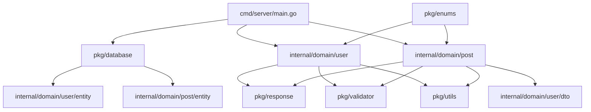

# 🚀 Study Go Controller

Go언어로 구현한 **Controller-Service-Repository-Entity** 패턴과 **DDD(Domain-Driven Design)**를 적용한 REST API 프로젝트입니다.

## 📁 프로젝트 구조

```
study-go-controller/
├── cmd/
│   └── server/                    # 🚀 애플리케이션 진입점
│       └── main.go               # 의존성 주입 및 서버 시작
├── internal/                     # 🏗️ 내부 패키지 (외부 접근 불가)
│   └── domain/                   # DDD 도메인별 구조
│       ├── user/                 # 👤 User 도메인
│       │   ├── entity/           # 사용자 엔티티
│       │   ├── repository/       # 데이터 액세스 계층
│       │   ├── service/          # 비즈니스 로직 계층
│       │   ├── handler/          # HTTP 요청 처리 계층
│       │   ├── dto/             # 데이터 전송 객체
│       │   ├── enums/           # User 도메인 특화 열거형
│       │   └── routes/          # User API 라우팅
│       └── post/                 # 📝 Post 도메인
│           ├── entity/
│           ├── repository/
│           ├── service/
│           ├── handler/
│           ├── dto/
│           ├── enums/           # Post 도메인 특화 열거형
│           └── routes/
├── pkg/                          # 📚 공통 패키지 (재사용 가능)
│   ├── database/                # 🗄️ 데이터베이스 연결 관리
│   ├── response/                # 📤 API 응답 표준화
│   ├── models/                  # 🔧 공통 모델 (BaseModel, Pagination)
│   ├── enums/                   # 🏷️ 도메인 간 공통 열거형
│   ├── utils/                   # 🛠️ 공통 유틸리티 함수
│   └── validator/               # ✅ 공통 검증 로직
├── configs/                     # ⚙️ 설정 파일
├── go.mod                       # 📦 Go 모듈 정의
├── go.sum                       # 🔒 의존성 잠금 파일
└── README.md                    # 📖 프로젝트 문서
```

## 🏗️ 아키텍처 패턴

### DDD (Domain-Driven Design)
- **도메인별 완전 분리**: 각 도메인(`user`, `post`)이 독립적인 구조
- **도메인 특화 요소**: DTO, Enums, Routes 모두 도메인 내부에 위치
- **경계 컨텍스트**: 도메인 간 의존성 최소화

### Clean Architecture Layers
```
┌─────────────────┐
│   Handler       │ ← HTTP 요청/응답 처리
├─────────────────┤
│   Service       │ ← 비즈니스 로직
├─────────────────┤
│   Repository    │ ← 데이터 액세스
├─────────────────┤
│   Entity        │ ← 도메인 모델
└─────────────────┘
```

### Package 분류 원칙
```
📁 internal/domain/  ← 도메인별 특화 로직
📁 pkg/             ← 여러 도메인에서 공통 사용
📁 cmd/             ← 애플리케이션 진입점
```

## 📋 패키지별 역할과 사용처

### 🔷 **cmd/server/main.go**
```go
역할: 애플리케이션 부트스트랩
사용: 
- pkg/database → 데이터베이스 초기화
- internal/domain/*/repository → 리포지토리 인스턴스 생성
- internal/domain/*/service → 서비스 인스턴스 생성
- internal/domain/*/handler → 핸들러 인스턴스 생성
- internal/domain/*/routes → 라우터 설정
```

### 🔷 **internal/domain/user/** (User 도메인)

#### `entity/user.go`
```go
역할: User 도메인 모델 정의
사용처:
- repository/user_repository.go (CRUD 작업)
- service/user_service.go (비즈니스 로직)
- dto/user_dto.go (DTO 변환)
```

#### `repository/user_repository.go`
```go
역할: User 데이터 액세스 계층
의존성:
- internal/domain/user/entity
- gorm.io/gorm (ORM)
사용처:
- service/user_service.go
```

#### `service/user_service.go`
```go
역할: User 비즈니스 로직
의존성:
- internal/domain/user/entity
- internal/domain/user/repository
- golang.org/x/crypto/bcrypt (암호화)
사용처:
- handler/user_handler.go
```

#### `handler/user_handler.go`
```go
역할: User HTTP 요청 처리
의존성:
- internal/domain/user/dto
- internal/domain/user/service
- pkg/response (표준 응답)
- github.com/gin-gonic/gin
사용처:
- routes/user_routes.go
```

#### `dto/user_dto.go`
```go
역할: User API 요청/응답 구조
의존성:
- internal/domain/user/entity
사용처:
- handler/user_handler.go
- post/dto/post_dto.go (Author 정보)
```

#### `enums/user_enums.go`
```go
역할: User 도메인 특화 열거형
포함: UserStatus, UserRole
사용처:
- entity/user.go
- service/user_service.go
- dto/user_dto.go
```

#### `routes/user_routes.go`
```go
역할: User API 라우팅
의존성:
- internal/domain/user/handler
- github.com/gin-gonic/gin
사용처:
- cmd/server/main.go
```

### 🔷 **internal/domain/post/** (Post 도메인)

#### `entity/post.go`
```go
역할: Post 도메인 모델 정의
의존성:
- internal/domain/user/entity (Author 관계)
사용처:
- repository/post_repository.go
- service/post_service.go
- dto/post_dto.go
```

#### `dto/post_dto.go`
```go
역할: Post API 요청/응답 구조
의존성:
- internal/domain/post/entity
- internal/domain/user/dto (Author 정보)
사용처:
- handler/post_handler.go
```

#### `enums/post_enums.go`
```go
역할: Post 도메인 특화 열거형
포함: PostStatus, PostCategory
사용처:
- entity/post.go
- service/post_service.go
- dto/post_dto.go
```

### 🔷 **pkg/** (공통 패키지)

#### `database/database.go`
```go
역할: 데이터베이스 연결 및 마이그레이션
의존성:
- internal/domain/user/entity
- internal/domain/post/entity
- gorm.io/gorm
- gorm.io/driver/mysql
사용처:
- cmd/server/main.go
```

#### `response/response.go`
```go
역할: API 응답 표준화
의존성:
- github.com/gin-gonic/gin
사용처:
- internal/domain/*/handler/*.go (모든 핸들러)
```

#### `models/common.go`
```go
역할: 공통 모델 및 페이지네이션
사용처:
- internal/domain/*/entity/*.go (BaseModel 상속)
- internal/domain/*/handler/*.go (페이지네이션)
```

#### `enums/common_enums.go`
```go
역할: 도메인 간 공통 열거형
포함: SortDirection, CommonStatus, Priority
사용처:
- internal/domain/*/service/*.go
- internal/domain/*/handler/*.go
- internal/domain/*/dto/*.go
```

#### `utils/string_utils.go`
```go
역할: 문자열 관련 유틸리티
사용처:
- internal/domain/*/service/*.go
- internal/domain/*/handler/*.go
- pkg/validator/
```

#### `validator/custom_validators.go`
```go
역할: 공통 검증 로직
의존성:
- 없음 (순수 함수)
사용처:
- internal/domain/*/service/*.go
- internal/domain/*/handler/*.go
```

## 🔗 의존성 관계 다이어그램



## 🚀 시작하기

### 1. 의존성 설치
```bash
go mod tidy
```

### 2. 환경변수 설정
```bash
cp configs/config.example .env
# .env 파일을 편집하여 데이터베이스 정보 입력
```

### 3. 데이터베이스 설정
MySQL 데이터베이스를 생성하고 연결 정보를 .env에 설정합니다.

### 4. 서버 실행
```bash
go run cmd/server/main.go
```

## 📡 API 엔드포인트

### Users API
```
POST   /api/v1/users           # 사용자 생성
GET    /api/v1/users           # 모든 사용자 조회
GET    /api/v1/users/:id       # 특정 사용자 조회
PUT    /api/v1/users/:id       # 사용자 수정
DELETE /api/v1/users/:id       # 사용자 삭제
```

### Posts API
```
POST   /api/v1/posts           # 포스트 생성
GET    /api/v1/posts           # 모든 포스트 조회
GET    /api/v1/posts/:id       # 특정 포스트 조회
PUT    /api/v1/posts/:id       # 포스트 수정
DELETE /api/v1/posts/:id       # 포스트 삭제
GET    /api/v1/posts/author/:id # 특정 사용자의 포스트 조회
```

### System API
```
GET    /health                 # 서버 상태 확인
```

## 🛠️ 사용된 기술 스택

- **Go 1.21**: 프로그래밍 언어
- **Gin**: HTTP 웹 프레임워크
- **GORM**: ORM 라이브러리
- **MySQL**: 관계형 데이터베이스
- **godotenv**: 환경변수 관리
- **bcrypt**: 암호 해싱

## 📋 주요 기능

### 1. 🏗️ 도메인별 완전 분리
- 각 도메인이 독립적인 패키지 구조
- 도메인별 Enums, DTO, Routes 분리
- 마이크로서비스 전환 용이

### 2. 📦 계층별 책임 분리
- **Handler**: HTTP 요청/응답만 처리
- **Service**: 순수 비즈니스 로직
- **Repository**: 데이터 액세스만 담당
- **Entity**: 도메인 모델 정의

### 3. 🔄 DTO 패턴 적용
- 요청/응답 데이터 구조 명확화
- Entity와 API 계약 분리
- 버전 관리 용이

### 4. 📤 표준화된 API 응답
```json
{
  "success": true,
  "message": "User created successfully",
  "data": {
    "id": 1,
    "username": "john_doe",
    "email": "john@example.com"
  }
}
```

### 5. 🏷️ 타입 안전한 Enums
- 도메인별 특화된 열거형
- 공통 열거형 재사용
- 컴파일 타임 타입 체크

### 6. ✅ 공통 검증 시스템
- 재사용 가능한 검증 함수
- 커스텀 에러 메시지
- 일관된 검증 규칙

## 🔧 개발 가이드

### 새 도메인 추가하기
1. `internal/domain/` 하위에 새 도메인 폴더 생성
2. 필요한 패키지들 구현 (`entity`, `repository`, `service`, `handler`, `dto`, `enums`, `routes`)
3. `cmd/server/main.go`에 의존성 주입 및 라우터 등록

### 새 API 엔드포인트 추가하기
1. **DTO 정의**: 요청/응답 구조체 작성
2. **Service 메서드**: 비즈니스 로직 구현
3. **Handler 메서드**: HTTP 요청 처리 로직
4. **Routes 등록**: 엔드포인트 라우팅 설정

### 공통 기능 추가하기
1. **pkg/utils/**: 도메인 무관한 유틸리티
2. **pkg/validator/**: 공통 검증 로직
3. **pkg/enums/**: 여러 도메인에서 사용하는 열거형

## 🎯 아키텍처 결정 이유

### ✅ **왜 Handler라고 부르나요?**
Go 커뮤니티에서는 HTTP 요청을 처리하는 함수를 "Handler"라고 부르는 것이 관례입니다.

### ✅ **왜 도메인별로 Enums를 분리했나요?**
- **응집도**: 해당 도메인에만 관련된 열거형
- **독립성**: 다른 도메인 변경에 영향받지 않음
- **확장성**: 마이크로서비스 분리 시 유리

### ✅ **pkg와 internal의 차이점은?**
- **pkg/**: 외부에서도 임포트 가능한 재사용 라이브러리
- **internal/**: Go 컴파일러가 외부 접근을 제한

### ✅ **왜 DTO를 별도로 만들었나요?**
- **API 안정성**: Entity 변경이 API에 직접 영향주지 않음
- **보안**: 민감한 필드(password) 노출 방지
- **유연성**: API 버전별 다른 응답 구조 가능

## ⚡ 성능 최적화 팁

1. **데이터베이스 최적화**
   ```go
   // 인덱스 활용
   db.Where("email = ?", email).First(&user)
   
   // 프리로드 사용
   db.Preload("Author").Find(&posts)
   ```

2. **메모리 최적화**
   ```go
   // 포인터 슬라이스 사용
   users := make([]*entity.User, 0, expectedSize)
   ```

3. **동시성 처리**
   ```go
   // 고루틴과 채널 활용
   go processUserData(userChan)
   ```

## 🧪 테스트 가이드

### 단위 테스트
```bash
go test ./internal/domain/user/service/...
go test ./pkg/utils/...
```

### 통합 테스트
```bash
go test ./internal/domain/user/...
```

## 📈 확장 계획

1. **인증/인가 시스템** (JWT, OAuth2)
2. **캐싱 레이어** (Redis)
3. **로깅 시스템** (Structured logging)
4. **모니터링** (Prometheus, Grafana)
5. **API 문서화** (Swagger)
6. **마이크로서비스 분리**

---

## 🤝 기여하기

1. 이 저장소를 포크합니다
2. 새 기능 브랜치를 생성합니다 (`git checkout -b feature/amazing-feature`)
3. 변경사항을 커밋합니다 (`git commit -m 'Add amazing feature'`)
4. 브랜치에 푸시합니다 (`git push origin feature/amazing-feature`)
5. Pull Request를 생성합니다

## 📝 라이센스

이 프로젝트는 MIT 라이센스 하에 배포됩니다. 